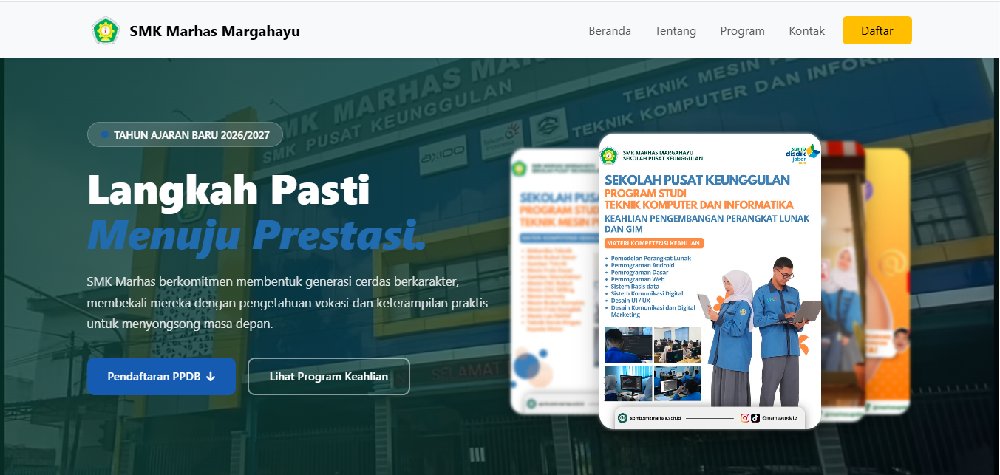
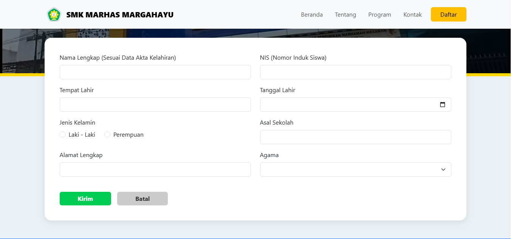
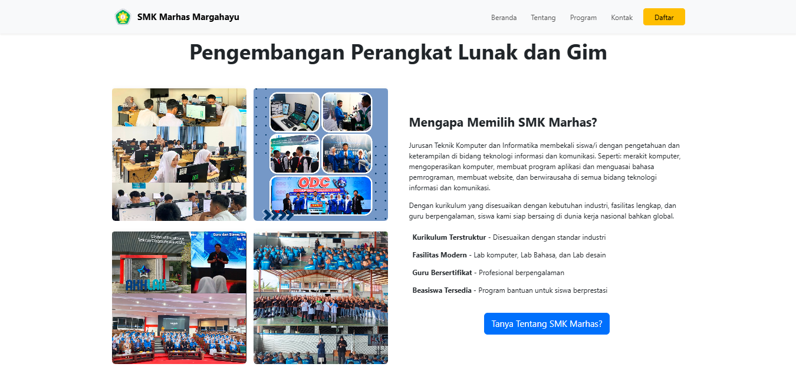

# 🎓 Website PPDB SMK Marhas Margahayu

Website Penerimaan Peserta Didik Baru (PPDB) SMK Marhas Margahayu yang dirancang untuk memudahkan calon peserta didik dalam memperoleh informasi dan melakukan pendaftaran secara online dengan tampilan yang modern, responsif, dan mudah digunakan.

## 📌 Deskripsi

Proyek ini merupakan website PPDB berbasis web yang menyediakan informasi lengkap mengenai sekolah, jurusan, alur pendaftaran, formulir pendaftaran online, lokasi sekolah, serta kontak yang dapat dihubungi oleh calon peserta didik maupun orang tua.

## 🔗 Demo Website


## ✨ Fitur Utama

- Landing Page Modern dan Responsif
- Informasi Profil Sekolah
- Informasi Jurusan
- Formulir Pendaftaran Online
- Validasi Formulir
- Google Maps Lokasi Sekolah
- Informasi Kontak Sekolah
- Tampilan Mobile Friendly
- Animasi dan Interaksi Modern

## 🛠️ Teknologi yang Digunakan

- HTML5
- CSS3
- Bootstrap 5
- JavaScript
- Google Maps Embed API

## 📂 Struktur Folder

```text
PPDB-MARHAS/
│
├── asset/             # Menyimpan seluruh gambar, foto, logo, dan icon
│
├── intercom.com/
├── PSAS1smt1/
├── revenue.com/
│
├── LandingPage.html   # Landing page utama
├── form.html          # Halaman pendaftaran siswa
├── allview.html       # Halaman tampilan data
├── karya1.html
├── karya2.html
├── karya3.html
├── karya4.html
├── karya5.html
├── karya6.html
├── karya7.html
│
└── README.md
```

## 🚀 Cara Menjalankan Project

1. Clone repository ini

```bash
git clone https://github.com/username/ppdb-marhas.git
```

2. Masuk ke folder project

```bash
cd ppdb-marhas
```

3. Jalankan file `LandingPage.html` menggunakan browser.

Atau gunakan extension **Live Server** pada Visual Studio Code.

## 📸 Screenshot



### Formulir Pendaftaran



### Informasi Jurusan



## 🎯 Tujuan Project

- Mempermudah proses pendaftaran peserta didik baru.
- Menyediakan informasi sekolah secara digital.
- Meningkatkan efisiensi penyampaian informasi kepada calon siswa.
- Sebagai implementasi pembelajaran Pengembangan Perangkat Lunak dan Gim (PPLG).

## 👨‍💻 Developer

**Alippy**

Siswa PPLG

## 📄 Lisensi

Project ini dibuat untuk keperluan pembelajaran dan pengembangan portofolio.